# Interactive Map Flow Documentation

## Overview

The Interactive Map component is the core visual element for displaying routes, points of interest (POIs), and handling user interactions in RouteWise. This document covers the complete flow, architecture, and troubleshooting guide.

## 🏗️ Architecture Overview

### Component Structure
```mermaid
graph TB
    subgraph "Route Results Page"
        RR[route-results.tsx]
    end
    
    subgraph "Interactive Map Component"
        IM[interactive-map.tsx]
        IM --> GM[Google Maps API]
        IM --> POI[POI Markers]
        IM --> RT[Route Display]
    end
    
    subgraph "Backend Services"
        API[Phoenix Backend]
        API --> MK[/api/maps-key]
        API --> POIS[/api/pois]
    end
    
    subgraph "External Services"
        GOOGLE[Google Maps Platform]
        GOOGLE --> MAPS[Maps JavaScript API]
        GOOGLE --> PLACES[Places API]  
        GOOGLE --> DIRS[Directions API]
    end
    
    RR --> IM
    IM --> API
    GM --> GOOGLE
    
    classDef component fill:#e1f5fe
    classDef service fill:#f3e5f5
    classDef external fill:#fff3e0
    
    class RR,IM component
    class API,MK,POIS service
    class GOOGLE,MAPS,PLACES,DIRS external
```

### Component Location
- **File**: `client/src/components/interactive-map.tsx`
- **Usage**: [[#Route Results Integration]], [[#Trip Planning Integration]]
- **Dependencies**: Google Maps JavaScript API, React Query

### Trip Wizard Integration
- **PlaceAutocomplete Component**: `client/src/components/place-autocomplete.tsx`
- **Manual Entry Support**: Users can proceed without autocomplete matches
- **Tab Navigation**: Tab key moves between start/end city fields for improved UX flow
- **Keyboard Controls**: Escape to cancel, Enter to select, Tab to navigate

## 🚀 Initialization Flow

### 1. Four-Layer Safety System
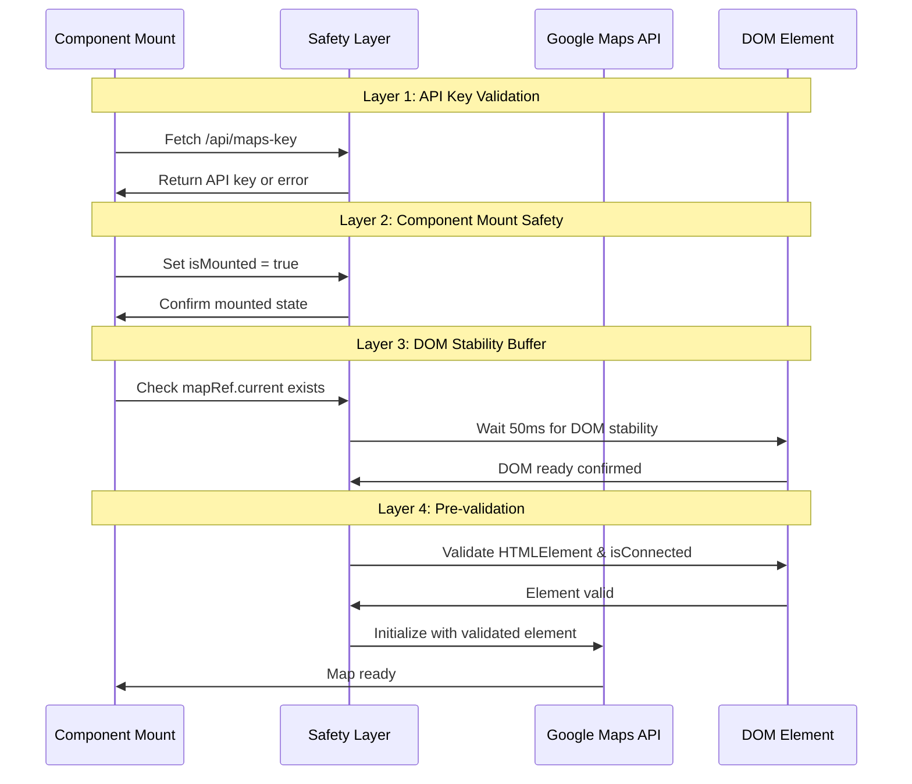

### 2. State Machine Flow
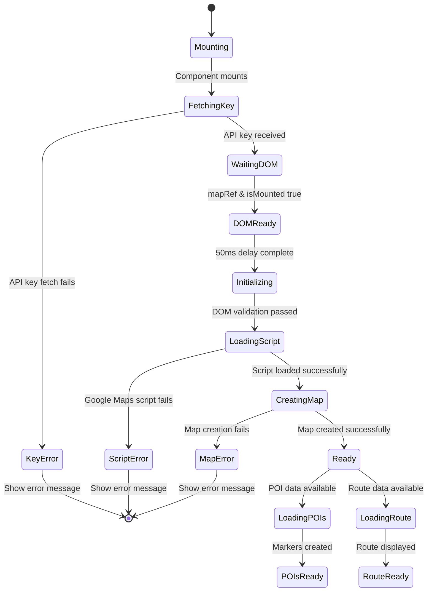

### 3. Component Lifecycle Integration
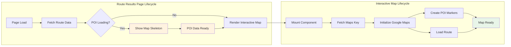

## 🗺️ Map Features & Data Flow

### POI Marker System
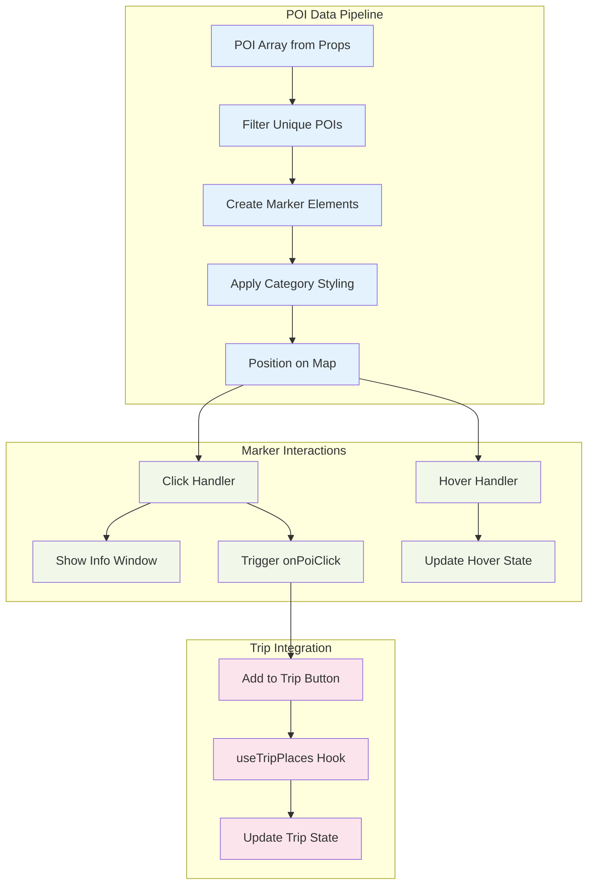

### Route Visualization Flow
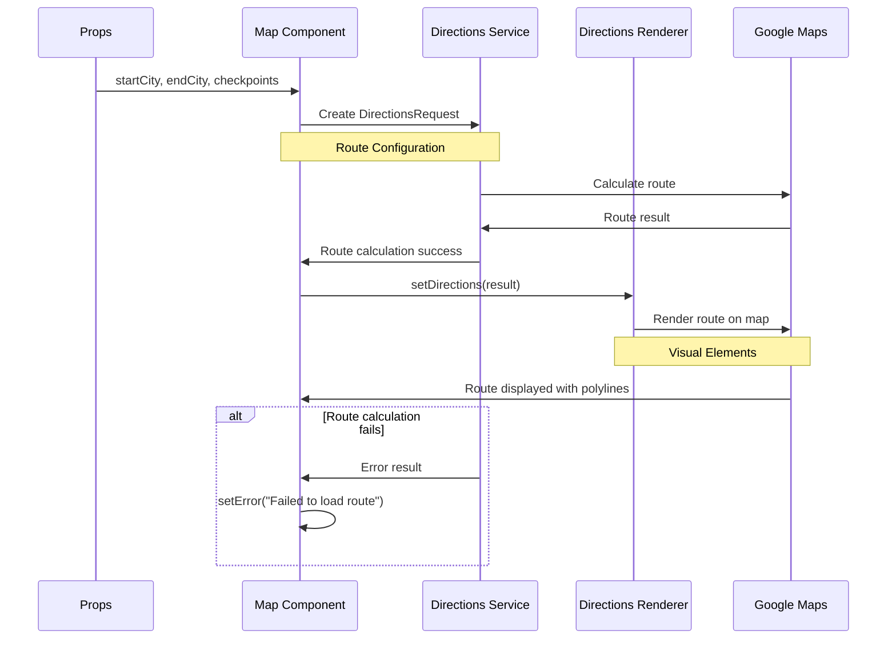

## 🔄 State Management Architecture

### Core States & References
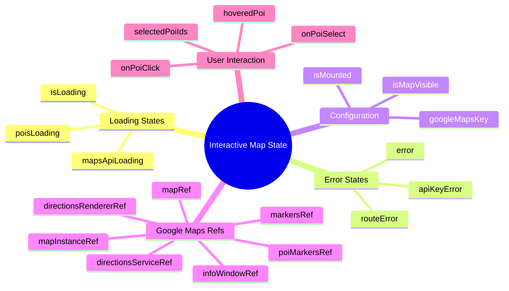

### Event Flow Architecture
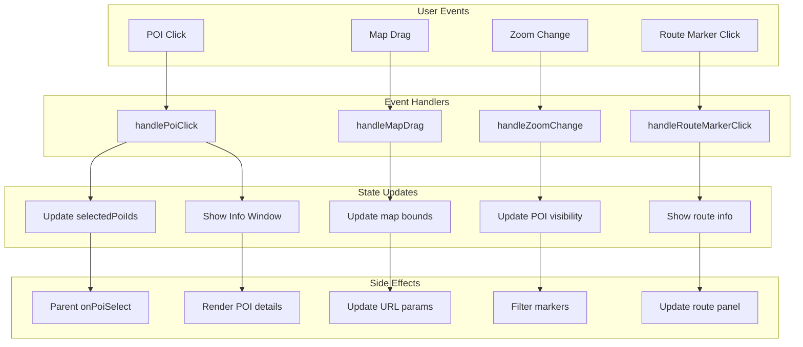

## 🐛 Error Handling & Recovery

### Error Classification System
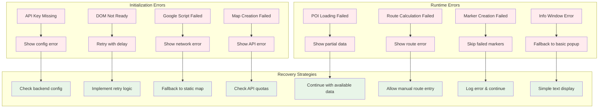

### Debugging Flow
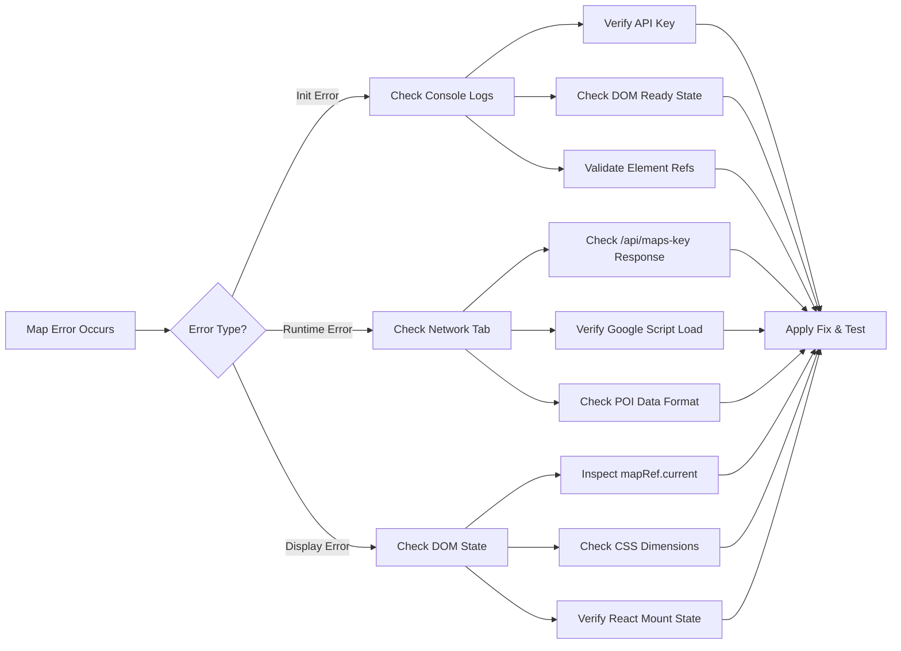

## 🔧 Configuration & Integration

### Backend Integration Points
```mermaid
graph TB
    subgraph "Phoenix Backend"
        A[MapsController] --> B[/api/maps-key endpoint]
        C[POIController] --> D[/api/pois endpoint]
        E[RoutesController] --> F[/api/routes/* endpoints]
    end
    
    subgraph "Frontend Integration"  
        B --> G[Map API Key Fetch]
        D --> H[POI Data Loading]
        F --> I[Route Calculation]
    end
    
    subgraph "Google Services"
        G --> J[Maps JavaScript API]
        H --> K[Places API Data]
        I --> L[Directions API]
    end
    
    subgraph "Map Rendering"
        J --> M[Map Instance Creation]
        K --> N[POI Marker Display]
        L --> O[Route Polyline Display]
    end
    
    M --> P[Interactive Map Ready]
    N --> P
    O --> P
```

### Route Results Integration
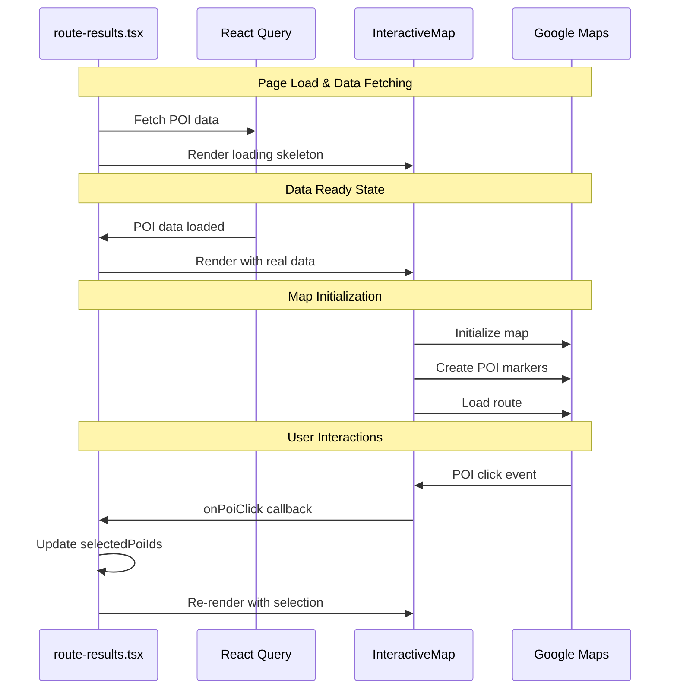

## 📊 Performance Optimization

### Rendering Optimization Strategy
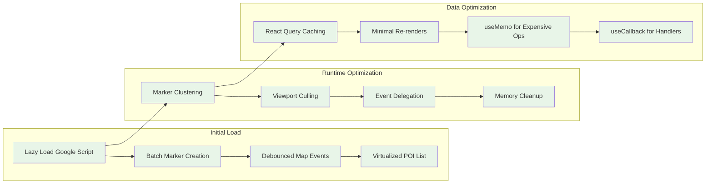

### Memory Management Flow
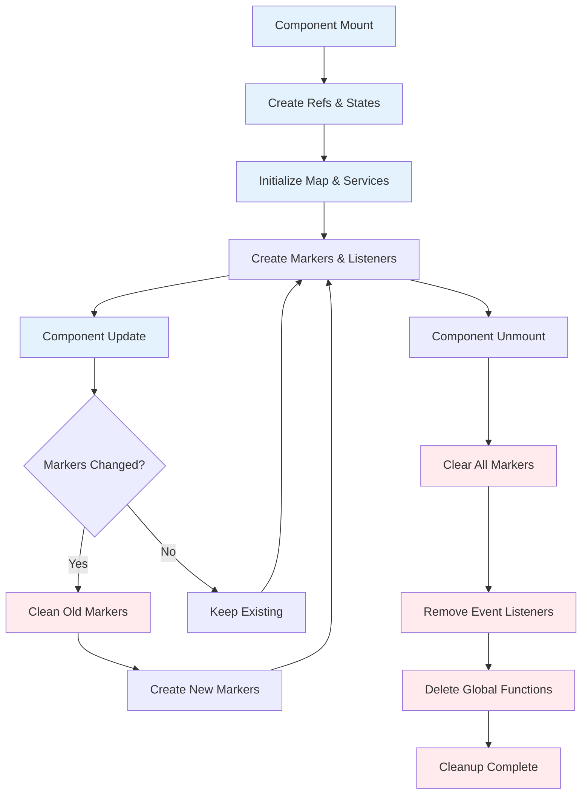

## 🧪 Testing Strategy

### Testing Pyramid Structure
```mermaid
graph TD
    subgraph "E2E Tests"
        A[Full Map Interaction Flow]
        B[POI Selection Journey] 
        C[Route Planning End-to-End]
    end
    
    subgraph "Integration Tests"
        D[Google Maps API Integration]
        E[Backend Endpoint Integration]
        F[React Query Data Flow]
        G[Component State Management]
    end
    
    subgraph "Unit Tests"
        H[Marker Creation Logic]
        I[Error Handling Functions]
        J[State Update Functions]
        K[Event Handler Logic]
        L[Data Transformation Utils]
    end
    
    A --> D
    B --> E  
    C --> F
    D --> H
    E --> I
    F --> J
    G --> K
    G --> L
    
    classDef e2e fill:#e8f5e8
    classDef integration fill:#fff3e0
    classDef unit fill:#f3e5f5
    
    class A,B,C e2e
    class D,E,F,G integration  
    class H,I,J,K,L unit
```

---

## Key Dependencies
```typescript
// Core Dependencies
import { useRef, useState, useCallback, useEffect } from "react";
import { useToast } from "@/hooks/use-toast";
import { useTripPlaces } from "@/hooks/use-trip-places";

// Google Maps Types (global)
declare global {
  interface Window {
    google: typeof google;
    addPoiToTrip: (poiIdentifier: string | number) => void;
  }
}
```

## Props Interface
```typescript
interface InteractiveMapProps {
  startCity: string;
  endCity: string;
  checkpoints: string[];
  pois: Poi[];
  selectedPoiIds?: number[];
  hoveredPoi?: Poi | null;
  onPoiClick?: (poi: Poi) => void;
  onPoiSelect?: (poi: Poi) => void;
  height?: string;
  className?: string;
}
```

## Environment Configuration
```bash
# Required
GOOGLE_PLACES_API_KEY=your_google_api_key_here

# Optional (falls back to GOOGLE_PLACES_API_KEY)
GOOGLE_MAPS_API_KEY=your_google_maps_key_here
```

---

*Last Updated: August 2025*
*Version: 1.0*

**Related Documentation:**
- [[ROUTE_RESULTS_FLOW.md]] - Route Results page integration
- [[../client/src/components/interactive-map.tsx]] - Source code
- [[../pages/route-results.tsx]] - Usage example