# Route Results Flow Documentation

## Overview

The Route Results page serves as the primary interface for exploring and managing discovered places along a planned route. This page combines filtered POI discovery, interactive mapping, and trip planning functionality in a cohesive, user-friendly experience.

## 🏗️ Page Architecture

### Component Structure
```mermaid
graph TB
    subgraph "Route Results Page"
        RR[route-results.tsx]
        RR --> H[Header Component]
        RR --> S[Sidebar - POI List]
        RR --> M[Main Area - Map/Grid]
        RR --> IT[Itinerary Button]
    end
    
    subgraph "Sidebar Components"
        S --> PC[PoiCard Components]
        S --> F[Filter Controls]
        S --> SL[Scrollable List]
    end
    
    subgraph "Main Area Components"
        M --> IM[InteractiveMap]
        M --> PG[POI Grid (when map hidden)]
        IM --> GM[Google Maps Integration]
    end
    
    subgraph "State Management"
        SM[React State]
        SM --> RQ[React Query]
        SM --> TP[Trip Places Hook]
        SM --> LS[Local Storage]
    end
    
    RR --> SM
    
    classDef page fill:#e3f2fd
    classDef component fill:#f1f8e9
    classDef state fill:#fce4ec
    
    class RR page
    class H,S,M,IT,PC,F,SL,IM,PG component
    class SM,RQ,TP,LS state
```

### Page Location & Routing
- **File**: `client/src/pages/route-results.tsx`
- **Route**: `/route-results?start={city}&end={city}`
- **Navigation**: Accessible from trip wizard completion
- **Fallback**: Local storage for route data persistence

## 🔄 Data Flow Architecture

### 1. Route Data Loading
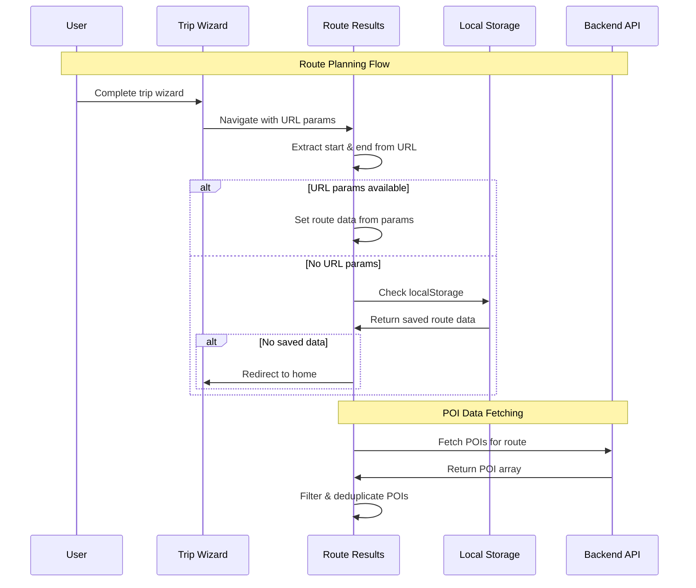

### 2. POI Data Pipeline
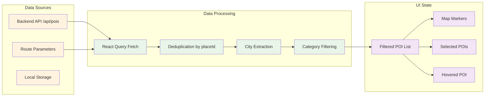

## 🎨 Layout & User Interface

### Responsive Layout System
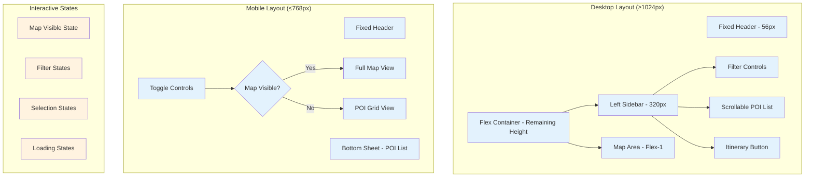

### Visual Hierarchy
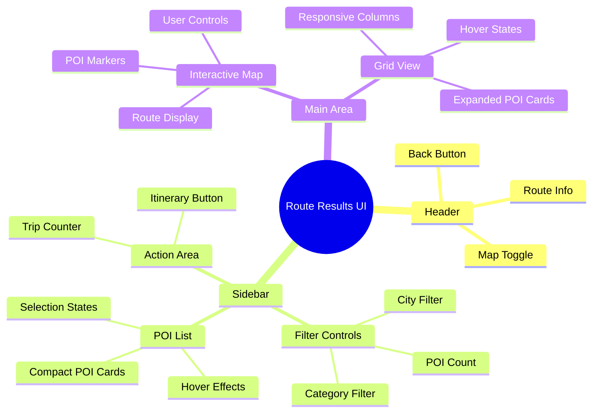

## 🔍 Filtering & Search System

### Filter Architecture
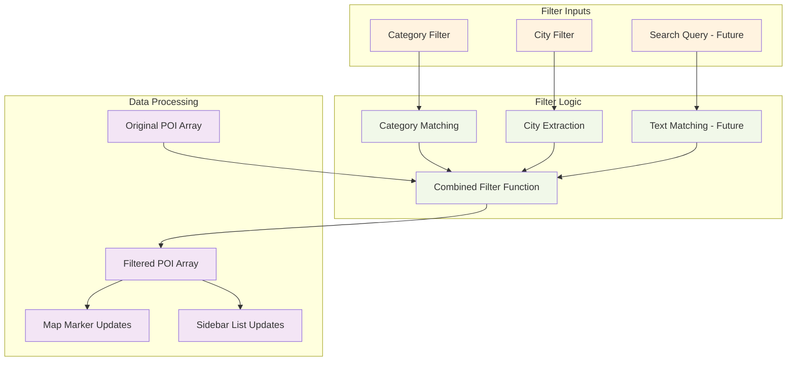

### City Extraction Algorithm
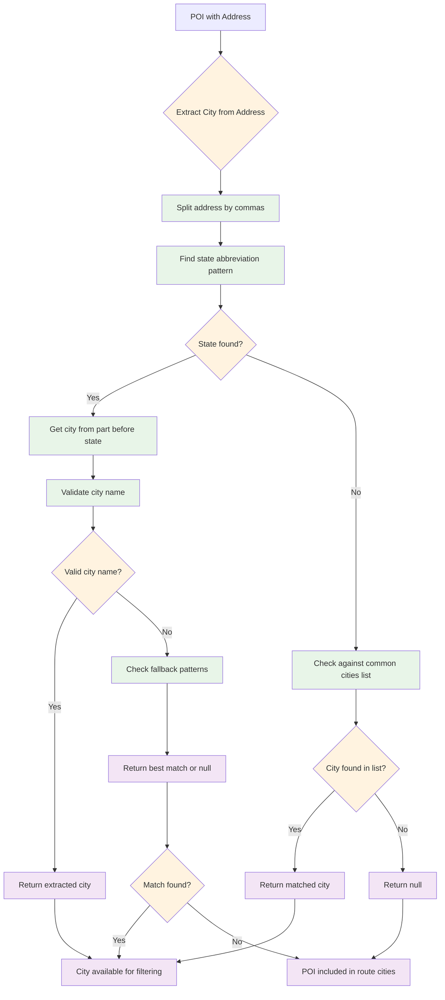

## 🗺️ Map Integration Flow

### Map Visibility Toggle System
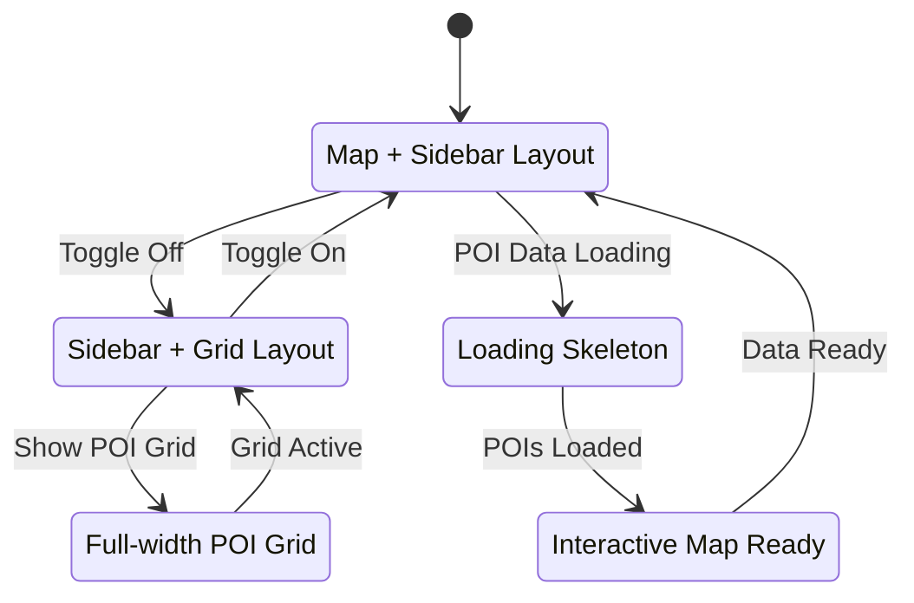

### Map-POI Synchronization
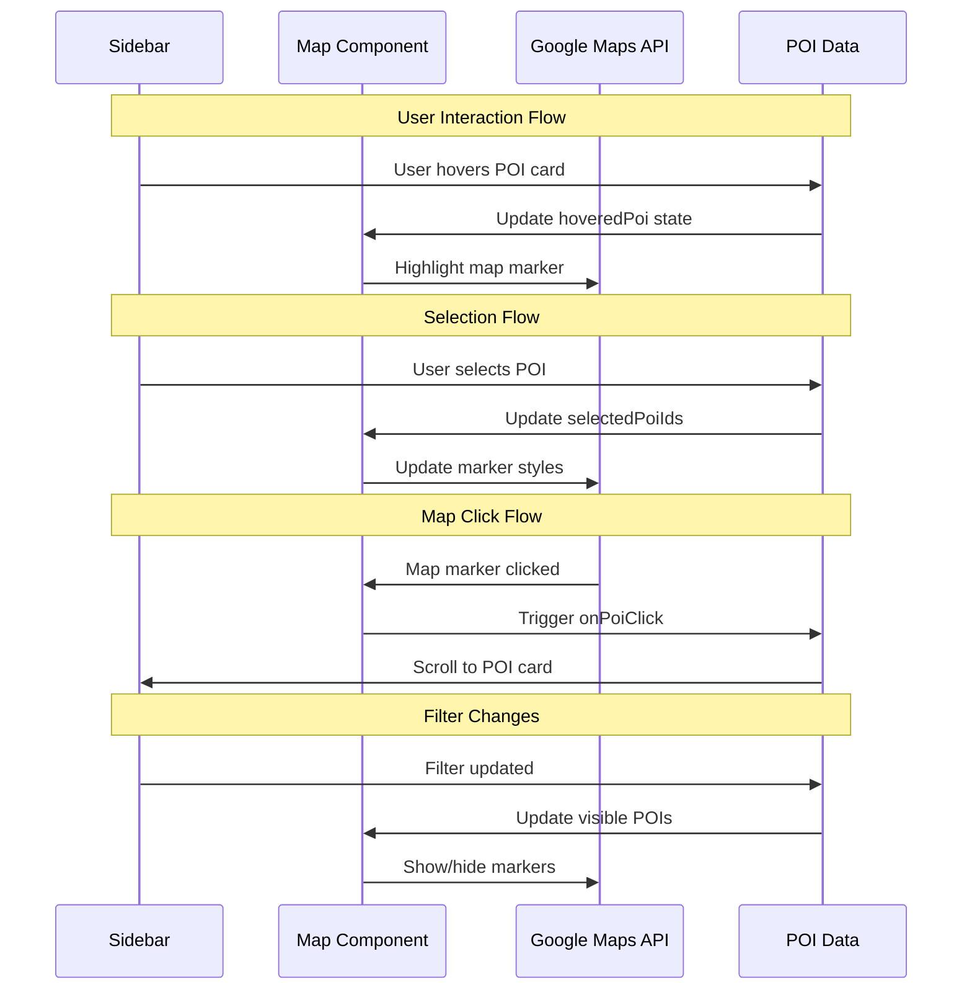

## 🎯 Trip Planning Integration

### Trip Places Management
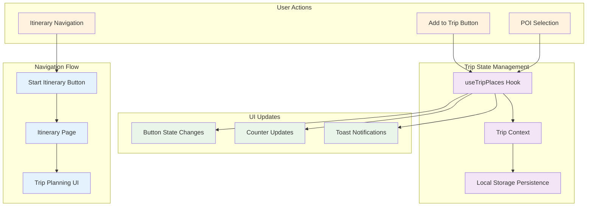

### Add to Trip Workflow
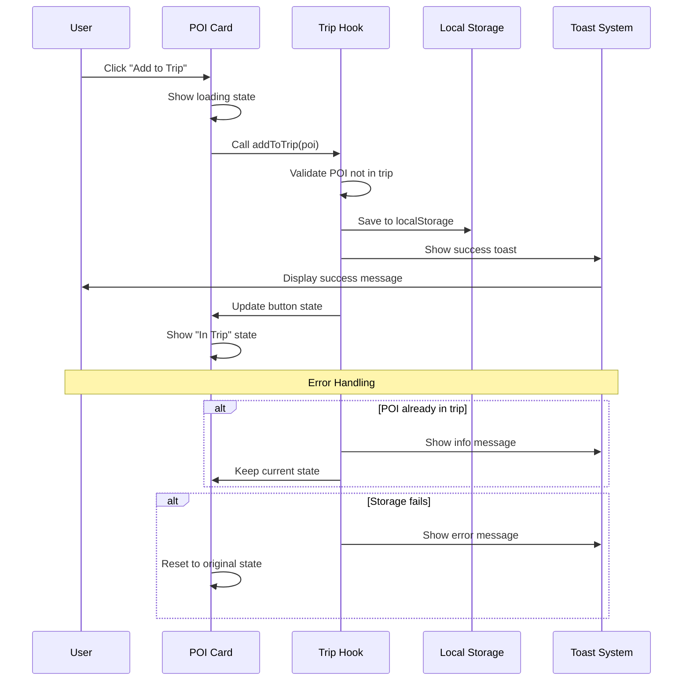

## 📱 Responsive Behavior

### Breakpoint System
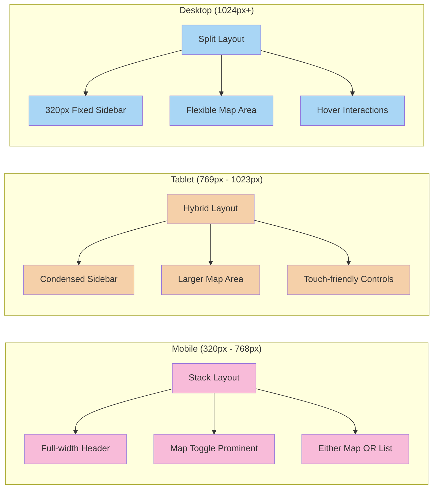

### Touch & Gesture Support
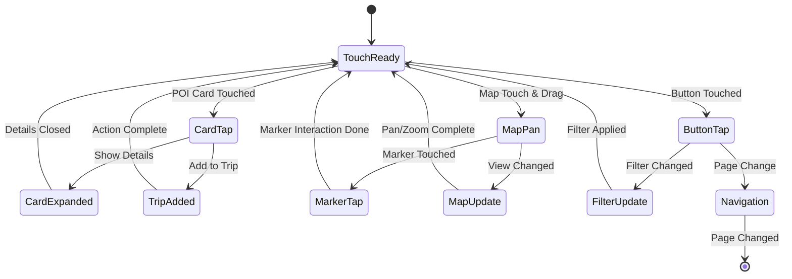

## ⚡ Performance Optimization

### Loading Strategy
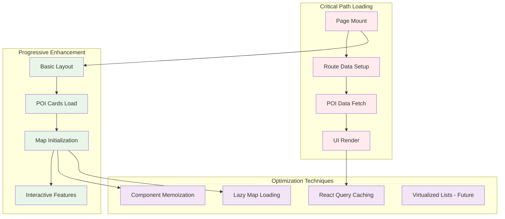

### Memory Management
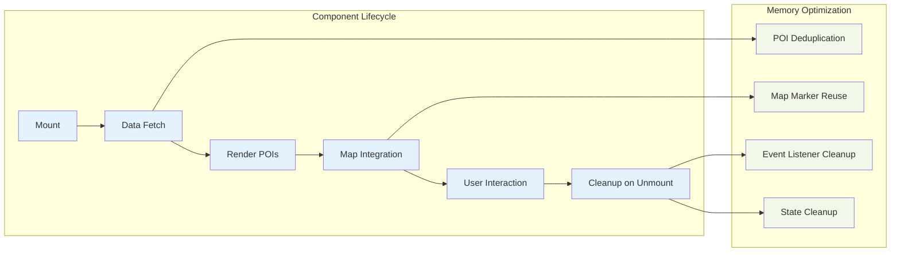

## 🔄 State Management Architecture

### React State Structure
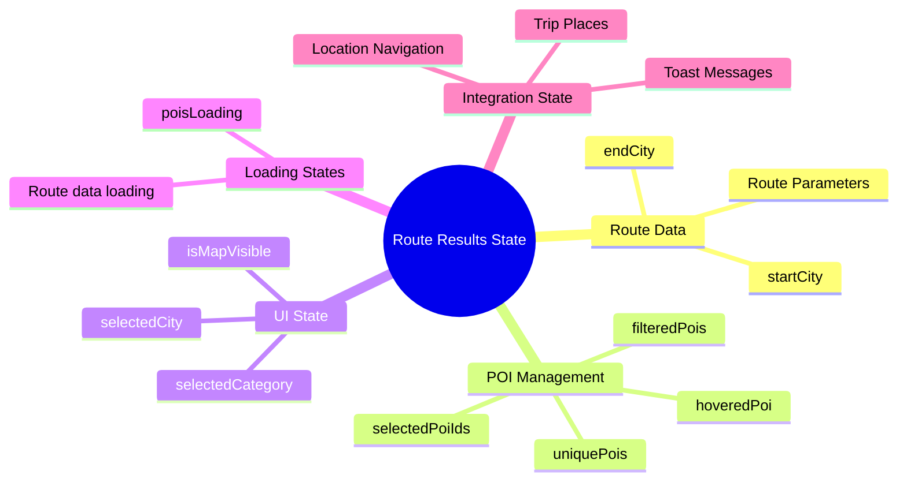

### State Update Flow
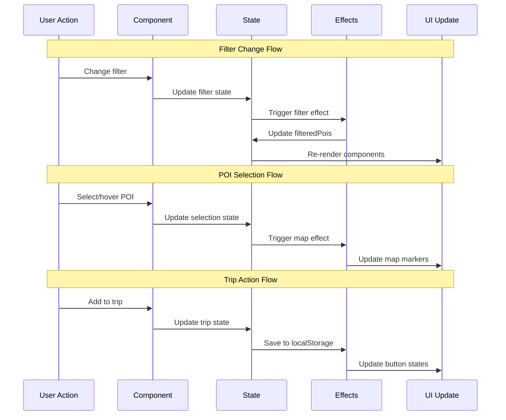

## 🧪 Testing Strategy

### Testing Pyramid
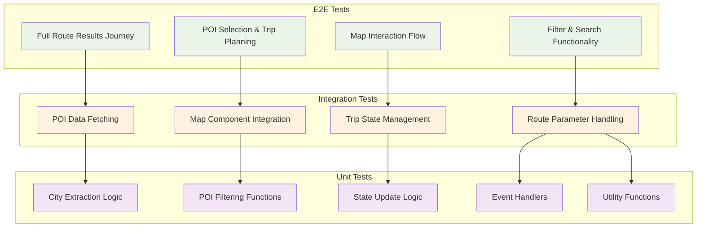

### Test Coverage Goals
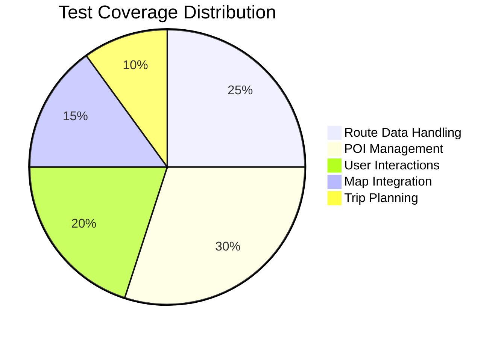

## 🐛 Error Handling & Edge Cases

### Error Classification
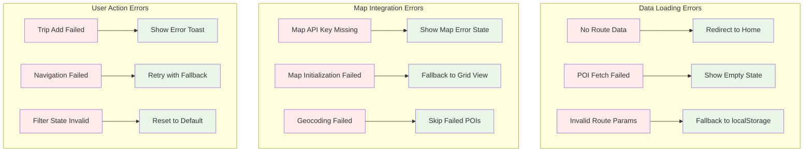

### Graceful Degradation Strategy
```mermaid
flowchart LR
    A[Full Functionality] --> B{Component Available?}
    B -->|Yes| C[Normal Operation]
    B -->|No| D[Degraded Mode]
    
    D --> E[Map Unavailable → Grid View]
    D --> F[POI Data Missing → Empty State]
    D --> G[Trip Feature Down → View Only]
    
    C --> H[Optimal User Experience]
    E --> I[Functional Alternative]
    F --> J[Clear Error Communication]
    G --> K[Partial Feature Set]
    
    classDef normal fill:#e8f5e8
    classDef degraded fill:#fff3e0
    classDef result fill:#f3e5f5
    
    class A,B,C normal
    class D,E,F,G degraded
    class H,I,J,K result
```

## 📊 Analytics & Monitoring

### User Interaction Tracking
```mermaid
mindmap
  root((Analytics Events))
    Page Views
      Route Results Loaded
      Route Parameters
      POI Count
    User Actions
      POI Card Interactions
      Map Interactions
      Filter Changes
      Trip Actions
    Performance Metrics
      Page Load Time
      POI Fetch Duration
      Map Initialization Time
    Error Events
      Data Loading Failures
      Map Errors
      User Action Failures
```

## 🔗 Integration Points

### Backend API Dependencies
```mermaid
graph TB
    subgraph "Phoenix Backend APIs"
        A[/api/pois - POI Data]
        B[/api/maps-key - Map Configuration]
        C[/api/routes - Route Saving - Future]
    end
    
    subgraph "External Services"
        D[Google Maps JavaScript API]
        E[Google Places API - via Backend]
        F[Google Directions API - via Backend]
    end
    
    subgraph "Client Storage"
        G[localStorage - Route Data]
        H[localStorage - Trip Places]
        I[sessionStorage - UI State]
    end
    
    A --> J[Route Results Page]
    B --> J
    C --> J
    D --> J
    E --> A
    F --> A
    G --> J
    H --> J
    I --> J
    
    classDef api fill:#fff3e0
    classDef external fill:#f3e5f5
    classDef storage fill:#e8f5e8
    
    class A,B,C api
    class D,E,F external
    class G,H,I storage
```

---

## Key Dependencies
```typescript
// Core React Dependencies
import { useLocation } from "wouter";
import { useEffect, useState, useMemo } from "react";
import { useQuery } from "@tanstack/react-query";

// UI Components
import { Button } from "@/components/ui/button";
import { Skeleton } from "@/components/ui/skeleton";
import PoiCard from "@/components/poi-card";
import { InteractiveMap } from "@/components/interactive-map";

// Hooks & Utils
import { useToast } from "@/hooks/use-toast";
import { useTripPlaces } from "@/hooks/use-trip-places";

// Icons
import { ArrowLeft, MapPin, Flag, Loader2, Map, Star, Calendar } from "lucide-react";
```

## Route Data Interface
```typescript
interface RouteData {
  startCity: string;
  endCity: string;
}

// POI filtering state
interface FilterState {
  selectedCategory: string;
  selectedCity: string;
  selectedPoiIds: number[];
  hoveredPoi: Poi | null;
  isMapVisible: boolean;
}
```

## Environment Requirements
```bash
# Backend API Base URL
VITE_API_BASE_URL=http://localhost:4001

# Required backend endpoints
GET /api/pois?start={city}&end={city}
GET /api/maps-key

# Google Services (via backend)
GOOGLE_PLACES_API_KEY=your_key_here
GOOGLE_MAPS_API_KEY=your_key_here
```

---

*Last Updated: August 2025*
*Version: 1.0*

**Related Documentation:**
- [[INTERACTIVE_MAP_FLOW.md]] - Interactive map component details
- [[../client/src/pages/route-results.tsx]] - Source code
- [[../client/src/components/interactive-map.tsx]] - Map component integration
- [[../client/src/components/poi-card.tsx]] - POI display component
- [[../client/src/hooks/use-trip-places.tsx]] - Trip management hook